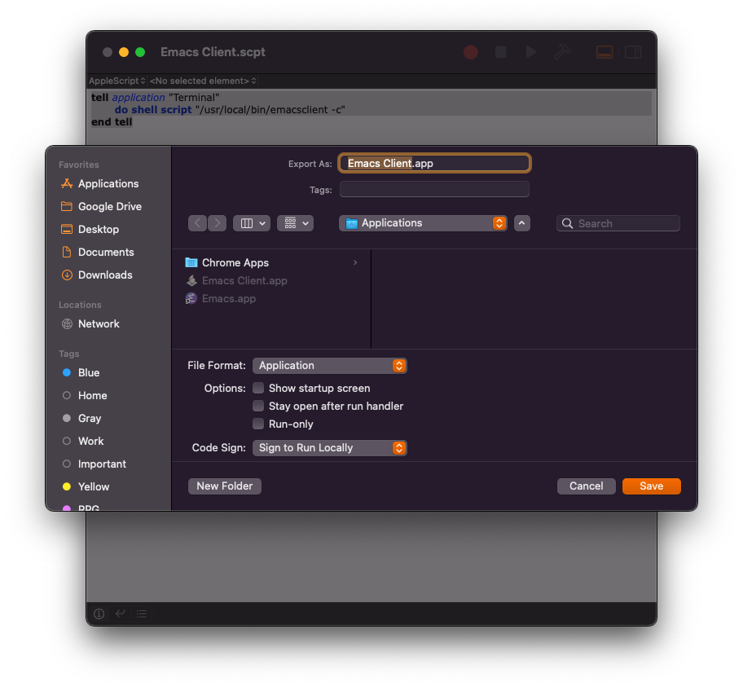

# DOOM Emacs

## Recommended packages

`init.el`:

``` emacs-lisp
       :editor
       parinfer            ; turn lisp into python, sort of

       :os
       (:if IS-MAC macos)  ; improve compatibility with macOS
       tty                 ; improve the terminal Emacs experience

       :lang
       (clojure +lsp)      ;
       json                ;
       markdown            ; 
       sh                  ; 
       yaml                ; 
```

## Running inside the terminal

Enable `tty` in the `init.el` and start emacs using `--no-window-system` option:

```sh
emacs -nw
```

## Running as daemon

> For HomeBrew installation, use `brew info` to check if there are related instructions.
> 
> e.g: `brew info emacs-plus@28`

Starting the daemon:

```sh
emacs --daemon
```

Alternatives: [EmacsWiki/EmacsDaemon](https://www.emacswiki.org/emacs/EmacsAsDaemon)

Connecting to it:

```sh
emacsclient -nw
```

## Aliases

`.zshrc` or similar:

``` sh
alias e="emacsclient -nw"
alias ekill="emacsclient -e '(kill-emacs)'"
alias edaemon="emacs --daemon"
alias erestart="ekill && edaemon"
```

## Creating "apps" (MacOS)

Using the application `Script Editor`:

```
tell application "Terminal"
    do shell script "/usr/local/bin/emacsclient --create-frame --no-wait"
end tell
tell application "Emacs" to activate
return
```

**Export** it `~/Applications/Emacs Client` using the `File Format` `Application`, as shown bellow:



### Setting the icon

Copy the icon from the emacs installation to your generated application. Example:

```
cp /usr/local/opt/emacs-plus@28/Emacs.app/Contents/Resources/Emacs.icns ~/Applications/Emacs\ Client.app/Contents/Resources/applet.icns
```

